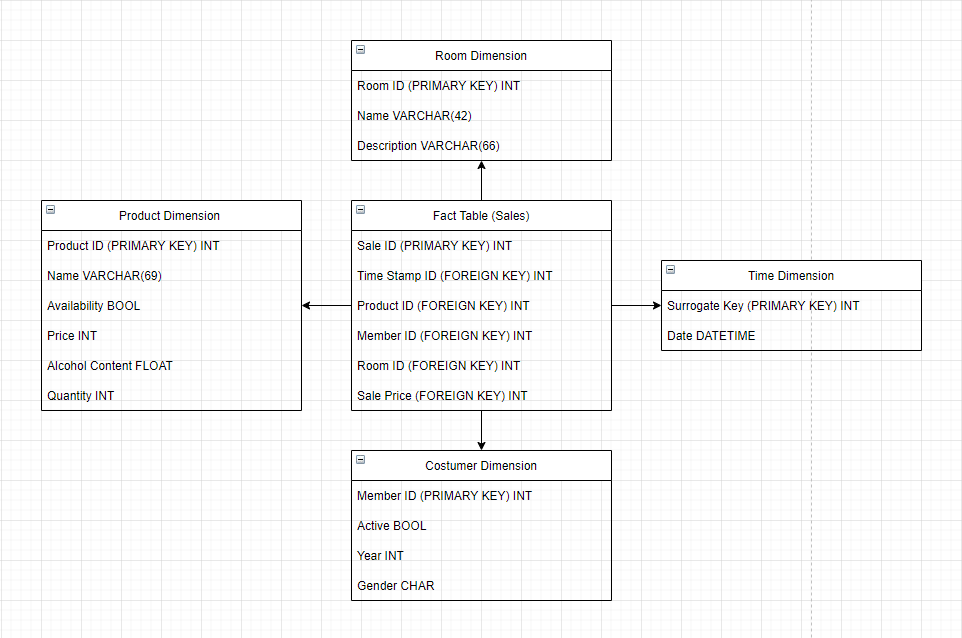

# F-Klub Case Project

<!-- The case is based on [this](https://docs.google.com/document/d/1XnfgLxeUi0umS9v05gplG7wA0-AefuFrgwt-9OoKzvU/edit).
 -->

The F-Klub Case project from 'Selected Topics in Database Research and Practic' course at Aalborg University

## Task B

Description
>*“Explore the source data. Consider which business processes you can model. Choose which business process you want to model. It is absolutely fine if you pick just one business process. Do not pick more than two business processes. Choose the granularity for your business process(es). Consider if your choices are reasonable for a paying customer. Give examples of the kinds of questions you want to be able to answer with the new BI solution.”*

### Answer
* Business process chosen: 
  * The business process chosen is sales
  * We want to be able to analyze the sales

* Granularity of business process: 
  * Individual sales of products
* Questions want to be able to answer:
  * Which are the most sold items?
  * Who is the biggest spender?
  * Which are product are popular in a specific period
  * It could be interesting to see what people buy in specific hours of the day, like coffee, energy drinks in the morning?
  * Sales per category?

## Task C

>*"Design the dimensions and choose the measures. You can choose to have SCDs, but it is also fine if you have no SCDs in this proof-of-concept.
"*

**Dimensions**:
* Product_dimension, time_dimension, customer_dimension, room_dimension

**Product_dimension**
* Product_id (lookup attribute)
* Name 
* Price 
* Availability
* Alchol_content
* quantity

**Time_dimenssion**
* Surrogate key
* Date (look_up attribute is the timestamp ~ composite key of the attributes)

**Customer_dimenstion**
* Member_id (lookup attributes)
* Active
* Year
* gender

**Room_dimenssion**
* Room_id (lookup attributes)
* Name
* description

**Fact table (sales)**
* Sale_id 
* Time_stamp (time_id)
* Product_id
* Member_id
* Room_id
* Sales price  (the measure)

Our database warehouse is made based on the following star-diagram:

